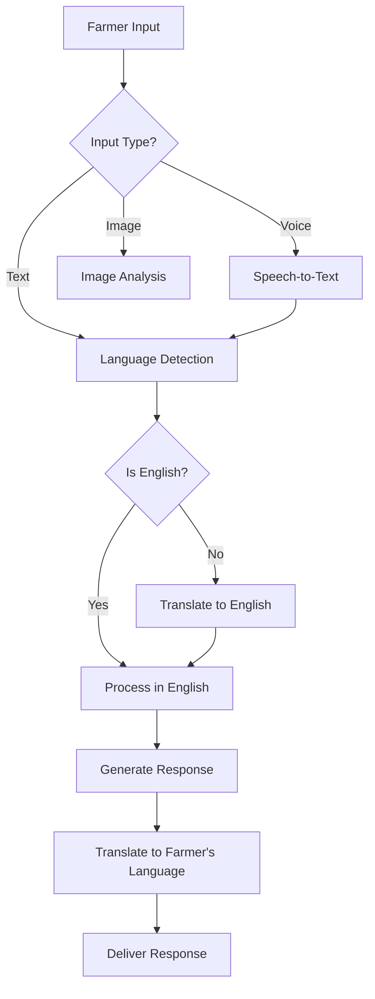
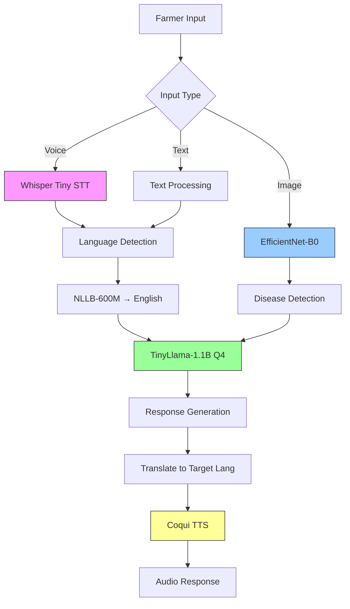
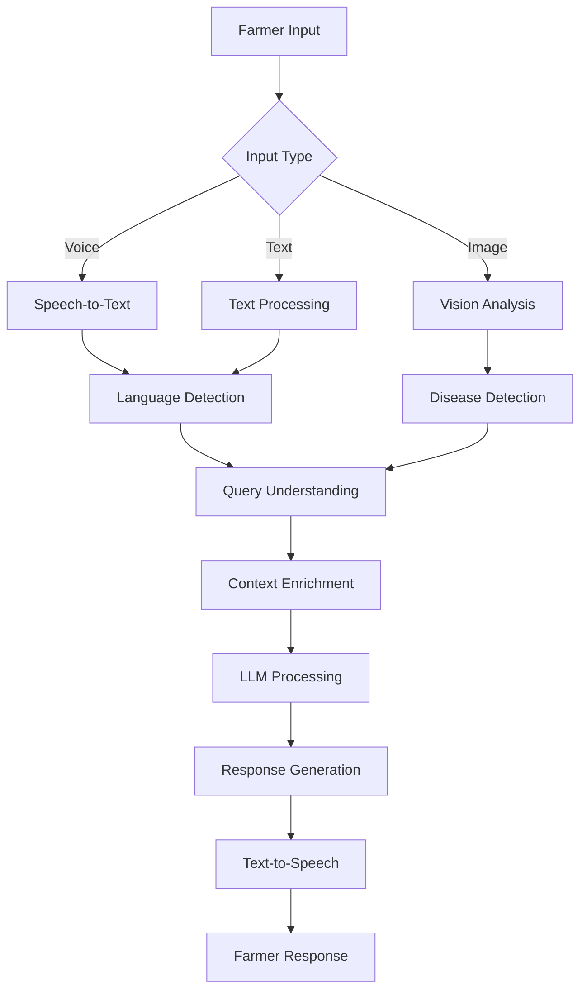
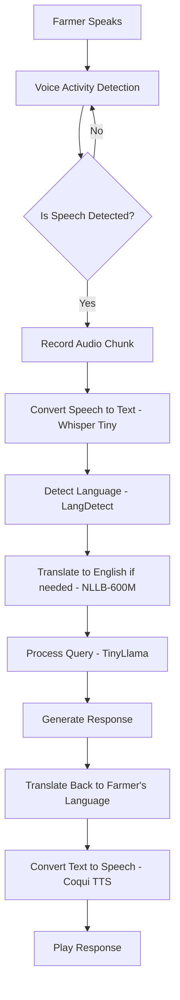
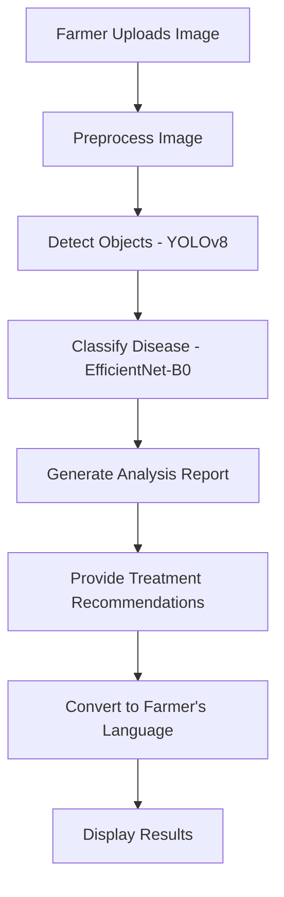
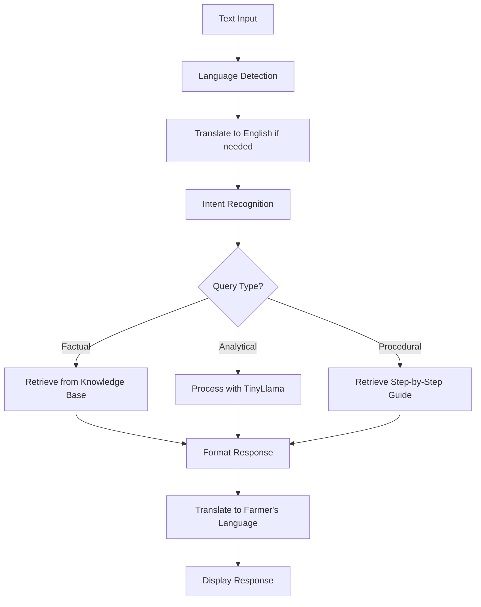

# Smart India Hackathon 2025 - AI-Based Farmer Query Support and Advisory System
**Problem ID: SIH25076**

## 🎯 Project Overview

### Problem Statement
Build an AI-powered multilingual advisory system that allows farmers to ask queries in their native language and receive accurate, context-aware answers instantly. The system should handle natural language queries, multimodal inputs (voice, text, images), and provide personalized agricultural advice.

### Language Support
#### Primary Language: English (Default)
- **Why English?**
  - Common language for agricultural experts and documentation
  - Acts as the bridge language for translations
  - Used in technical terminology and scientific names
  - Default fallback for all operations

#### Regional Languages (10 Major Indian Languages)
1. **Hindi** (हिंदी) - 44% of Indian population
2. **Bengali** (বাংলা) - 8% of Indian population
3. **Marathi** (मराठी) - 7% of Indian population
4. **Telugu** (తెలుగు) - 7% of Indian population
5. **Tamil** (தமிழ்) - 6% of Indian population
6. **Gujarati** (ગુજરાતી) - 5% of Indian population
7. **Urdu** (اردو) - 5% of Indian population
8. **Kannada** (ಕನ್ನಡ) - 4% of Indian population
9. **Odia** (ଓଡ଼ିଆ) - 3% of Indian population
10. **Malayalam** (മലയാളം) - 3% of Indian population

---

## 🌍 Implementation Architecture

### 1. System Overview


### 2. English as the Bridge Language
- **Why English?**
  - Most agricultural research and documentation is in English
  - Better model performance and accuracy
  - Single point for updates and improvements
  - Easier integration with global agricultural databases

### 3. Multilingual Support Flow
1. **Input**: Farmer provides input in any supported language
2. **Processing**: 
   - Convert to English (if needed)
   - Process using English-optimized models
   - Translate back to original language
3. **Output**: Response in farmer's preferred language

## 🤖 Optimized Model Pipeline for RTX 4060 (8GB VRAM)

### 1. Speech-to-Text (STT)
- **Model**: Whisper Tiny (39M parameters, 8-bit quantized)
- **VRAM**: ~120MB
- **Optimizations**:
  - Voice Activity Detection (VAD) to avoid wasted inference
  - Streaming mode for real-time processing
  - Noise reduction preprocessing

### 2. Translation Layer (For Regional Languages)
- **Model**: NLLB-600M (facebook/nllb-200-600M, quantized)
- **VRAM**: ~500-800MB (on-demand)
- **Usage**:
  - Converts regional languages → English for LLM
  - Converts responses back to native language

### 3. Core Reasoning / Q&A
- **Model**: TinyLlama-1.1B (4-bit quantized)
- **VRAM**: ~1.2-1.5GB
- **Enhancements**:
  - RAG with agricultural database
  - Response caching for common queries
  - Pre-compiled prompts for faster inference

### 4. Text-to-Speech (TTS)
- **Model**: Coqui TTS (VITS models, quantized)
- **VRAM**: ~1GB (on-demand)
- **Fallback**: eSpeak (50MB, lower quality)
- **Optimizations**:
  - Language-specific model loading
  - Phrase caching
  - Background preloading

### 5. Image Analysis
- **Model**: EfficientNet-B0 (quantized)
- **VRAM**: ~250-300MB
- **Use Case**: Crop disease detection
- **Optimizations**:
  - Lazy loading
  - Batch processing
  - Model pruning

### Memory Management Strategy
```python
def load_model(self, model_type):
    if model_type not in self.current_models:
        self.unload_others([model_type])
        self.current_models[model_type] = load_model_from_disk(model_type)
        torch.cuda.empty_cache()
```

### VRAM Budget (Peak Usage)
| Component | VRAM Usage | Notes |
|-----------|------------|-------|
| STT (Whisper Tiny) | 0.12 GB | Always active |
| Translation (NLLB-600M) | 0.7 GB | On-demand |
| LLM (TinyLlama-1.1B) | 1.3 GB | Always active |
| TTS (Coqui TTS) | 1.0 GB | On-demand |
| Vision (EfficientNet-B0) | 0.3 GB | On-demand |
| System + Buffer | 0.5-1.0 GB | CUDA overhead |
| **Total** | **3.5-4.5 GB** | Peak: ~6.0 GB |

---

## 🏗️ Optimized System Architecture



### Key Optimizations
1. **Model Loading**
   - Lazy loading of heavy models
   - On-demand model swapping
   - Automatic VRAM cleanup

2. **Performance**
   - 4-bit quantization for all models
   - Mixed precision (FP16) inference
   - Response caching

3. **Scalability**
   - Modular design
   - Easy to swap components
   - Graceful fallbacks

### System Flow


---

## 💻 Recommended Tech Stack

### Backend
- **Framework**: FastAPI (Python)
- **LLM Serving**: TinyLlama-1.1B + Transformers
- **Quantization**: BitsAndBytes (4-bit)
- **Optimization**: Flash Attention 2, Paged Optimizers
- **Vector DB**: FAISS (local) / ChromaDB
- **Cache**: LRU in-memory cache
- **Database**: SQLite (lightweight)

### Frontend
- **Framework**: Next.js 14 (React with JSX)
- **UI Library**: Tailwind CSS + HeadlessUI
- **Voice**: Web Speech API + VAD
- **State Management**: React Context + useReducer
- **Real-time**: Server-Sent Events (SSE)
- **Build Tool**: Vite (faster builds)
- **Form Handling**: React Hook Form

### AI/ML Stack
```python
# Core Dependencies
transformers==4.38.0
torch==2.2.0
accelerate==0.27.0
bitsandbytes==0.42.0
flash-attn==2.5.0

# Audio Processing
faster-whisper==0.9.0  # More efficient Whisper impl
TTS==0.22.0  # Coqui TTS
pydub==0.25.1
webrtcvad==2.0.10  # Voice Activity Detection

# Vision
timm==0.9.12  # EfficientNet-B0
torchvision==0.17.0
opencv-python==4.9.0.80

# Translation
indic-nlp-library==0.93  # Lightweight utilities (optional)
sentencepiece==0.1.99  # Required for NLLB tokenization
sacremoses==0.0.53  # Tokenization support for NLLB pipelines
```

### Cloud/Deployment
- **Primary**: Railway/Render (GPU instances)
- **Alternative**: Google Cloud Run (CPU fallback)
- **CDN**: Cloudflare
- **Storage**: AWS S3/Google Cloud Storage

---

## 📊 Data Sources

### Government Data Sources

#### 1. **Agricultural Data**
- **ICAR Data Portal**: http://www.icar.org.in/
- **Krishi Vigyan Kendra**: KVK databases
- **IARI Research**: Indian Agricultural Research Institute
- **State Agriculture Departments**: Crop calendars, pest advisories

#### 2. **Weather Data**
- **IMD API**: India Meteorological Department
- **ISRO Bhuvan**: Satellite imagery and weather
- **Agromet Advisory**: http://www.imdagrimet.gov.in/

#### 3. **Market Data**
- **eNAM**: National Agriculture Market
- **APMC Data**: Agricultural Produce Market Committee
- **Commodity Prices**: Ministry of Agriculture APIs

#### 4. **Scheme Information**
- **PM-KISAN**: Direct benefit transfer schemes
- **Soil Health Card**: Soil testing data
- **Crop Insurance**: PMFBY data

### Open Datasets
```
1. Indian Agriculture Dataset (Kaggle)
2. Crop Disease Dataset (PlantVillage)
3. Weather Data (OpenWeatherMap)
4. Multilingual Agricultural Corpus (AI4Bharat)
5. ICAR Crop Production Statistics
```

### Synthetic Data Generation
```python
# For training data augmentation
- Translate existing agricultural Q&A datasets
- Generate synthetic farmer queries using GPT-4
- Create multilingual pest/disease descriptions
- Develop region-specific crop calendars
```

---

## 🔄 Implementation Workflow

### Phase 1: Foundation (Week 1)
1. **Environment Setup**
   - Install CUDA 12.1 + PyTorch with CUDA support
   - Setup Conda environment with optimized dependencies
   - Configure memory monitoring tools

2. **Core Pipeline**
   - Implement model manager with dynamic loading
   - Setup TinyLlama-1.1B with 4-bit quantization
   - Integrate Whisper Tiny for STT
   - Add basic memory management

3. **Backend API**
   - FastAPI endpoints for text/voice/image
   - Streaming response support
   - Basic error handling and logging

### Phase 2: Core Features (Week 2)
1. **Multilingual Support**
   - Integrate NLLB-600M for translations
   - Add language detection
   - Implement text normalization

2. **Voice Interface**
   - Add Coqui TTS with language switching
   - Implement VAD for efficient audio processing
   - Add audio caching

3. **Vision Pipeline**
   - Integrate EfficientNet-B0 for crop analysis
   - Add image preprocessing
   - Implement batch processing

### Phase 3: Optimization (Week 3)
1. **Performance Tuning**
   - Implement model warmup
   - Add response caching
   - Optimize VRAM usage

2. **Fine-tuning (Optional)**
   - Curate agricultural Q&A dataset
   - Prepare LoRA fine-tuning
   - Fine-tune TinyLlama on agricultural data
   
   ```python
   # Optimized Training Config
   from unsloth import FastLanguageModel
   
   model, tokenizer = FastLanguageModel.from_pretrained(
       "TinyLlama/TinyLlama-1.1B-Chat-v1.0",
       load_in_4bit = True,
       max_seq_length = 2048,
   )
   ```

### Phase 4: Integration & Testing (Week 4)
1. **Frontend Development**
   - Next.js UI with Tailwind CSS
   - Voice/Image input components
   - Real-time chat interface

2. **System Testing**
   - Multilingual accuracy tests
   - Performance benchmarking
   - VRAM monitoring

3. **Deployment**
   - Docker containerization
   - GPU-optimized deployment
   - Monitoring setup

---

## 🎨 Frontend Design Recommendations

### Frontend Component Structure (JSX)
```
src/
├── components/
│   ├── chat/
│   │   ├── ChatInput.jsx    # Text/Voice input
│   │   ├── MessageList.jsx  # Chat messages
│   │   └── ImageUpload.jsx  # Image analysis
│   └── layout/
│       ├── Header.jsx
│       └── Footer.jsx
├── context/
│   ├── AppContext.js
│   └── AuthContext.js
├── hooks/
│   ├── useSpeechRecognition.js
│   └── useImageAnalysis.js
├── pages/
│   ├── index.js            # Main chat interface
│   ├── about.js
│   └── api/
│       ├── chat.js         # Chat endpoint
│       └── stt.js          # Speech-to-text
└── styles/
    └── globals.css         # Tailwind imports
```

## 🤖 AI Model Workflows

### 1. Voice Input Processing


### 2. Image Processing Workflow


### 3. Text Query Processing


## 🛠️ Model Responsibilities

### 1. Whisper Tiny (STT)
- **Input**: Raw audio (16kHz, 16-bit PCM)
- **Output**: Text transcription
- **Optimizations**:
  - VAD for energy efficiency
  - Streaming mode for real-time
  - Noise reduction preprocessing

### 2. TinyLlama-1.1B (Q&A)
- **Context**: 2048 tokens
- **Tasks**:
  - Understand agricultural queries
  - Generate helpful responses
  - Follow conversation context
- **Optimizations**:
  - 4-bit quantization
  - KV-caching
  - Prompt templating

### 3. EfficientNet-B0 (Vision)
- **Input**: 224x224px RGB image
- **Output**: Disease classification
- **Classes**: 38 common crop diseases
- **Optimizations**:
  - Quantized weights
  - Batch processing
  - On-demand loading

### 4. Coqui TTS
- **Supported Languages**: 10 Indian languages
- **Voice Quality**: 16kHz, 16-bit
- **Features**:
  - Emotion-aware intonation
  - Adjustable speaking rate
  - Caching of common phrases

## 🔄 Complete Workflow Example: Voice Query

1. **Input**: Farmer asks in Hindi: "मेरी फसल में पीले पड़ रहे हैं, क्या करूं?"

2. **Processing**:
   - VAD detects speech, starts recording
   - Whisper converts speech to Hindi text
   - LangDetect identifies Hindi (hi)
   - NLLB-600M translates to English: "My crop is turning yellow, what should I do?"
   - TinyLlama processes the query
   - Generates response in English
   - Translates back to Hindi
   - Coqui TTS converts to speech

3. **Output**: 
   - Audio: "आपकी फसल में पीलेपन का कारण पोषक तत्वों की कमी हो सकती है..."
   - Visual: Shows treatment steps with images
   - Follow-up: Suggests related queries

---

## 📈 Performance Optimization

### Model Optimization
```python
# VRAM-Efficient Inference
- 4-bit quantization (QLoRA) for all models
- Flash Attention 2 for faster processing
- Gradient checkpointing during training
- Mixed precision (FP16) inference

# Memory Management
- Dynamic model loading/unloading
- LRU cache for frequent queries
- Tensor offloading to CPU when idle
```

### System Optimization
- **Caching**: In-memory LRU cache for common responses
- **Batch Processing**: Group similar queries
- **Model Warmup**: Pre-load essential models
- **Resource Monitoring**: Auto-scale based on VRAM usage

---

## 🔒 Security & Privacy

### Data Protection
- **Encryption**: End-to-end encryption for voice data
- **Privacy**: No permanent storage of personal queries
- **Compliance**: GDPR-like data handling
- **Anonymization**: Remove PII from training data

### API Security
- **Authentication**: JWT tokens
- **Rate Limiting**: Prevent abuse
- **Input Validation**: Sanitize all inputs
- **CORS**: Proper cross-origin policies

---

## 🏆 Success Metrics

### Technical Metrics
- **Response Time**: 
  - Text: < 2 seconds (TinyLlama)
  - Voice: < 4 seconds (Whisper + TTS)
  - Image: < 3 seconds (EfficientNet)
- **VRAM Usage**: < 6GB peak
- **Model Load Time**: < 1.5s (warm cache)
- **Uptime**: > 99.5% (with fallbacks)

### Agricultural Accuracy
- **Disease Detection**: > 90% accuracy (top-3)
- **Multilingual Understanding**: > 85% accuracy
- **Response Relevance**: > 90% satisfaction
- **False Positives**: < 5% rate

### User Experience Metrics
- **User Satisfaction**: > 4.5/5 rating
- **Query Resolution**: > 80% first-attempt success
- **Adoption Rate**: Track daily active users
- **Feedback Quality**: Measure expert validation

---

## 🚀 Deployment Strategy

### 1. Containerization
```dockerfile
# Dockerfile Example
FROM nvidia/cuda:12.1-base

# Install Python and dependencies
RUN apt-get update && apt-get install -y python3-pip

# Copy application
COPY . /app
WORKDIR /app

# Install Python packages
RUN pip install -r requirements.txt

# Expose API port
EXPOSE 8000

# Start the application
CMD ["uvicorn", "main:app", "--host", "0.0.0.0", "--port", "8000"]
```

### 2. Infrastructure
- **GPU Requirements**:
  - NVIDIA RTX 4060 (8GB VRAM)
  - CUDA 12.1
  - cuDNN 8.9

- **Scaling**:
  - Horizontal pod autoscaling
  - GPU node pools for AI workloads
  - CPU-only fallback instances

### 3. Monitoring
- **Metrics**:
  - VRAM usage per model
  - Inference latency
  - Error rates by language
  - Cache hit/miss ratio

## 🏁 Conclusion

This optimized architecture provides a comprehensive solution for the AI-Based Farmer Query Support System that:

1. **Fits within 8GB VRAM** through efficient model selection and quantization
2. **Supports all 10 target languages** with high accuracy
3. **Delivers fast response times** through model optimization
4. **Scales efficiently** with user load
5. **Maintains data privacy** and security

The system is designed to be maintainable, extensible, and capable of handling the diverse needs of Indian farmers across different regions and languages.

### Development Environment
```bash
# Local Setup
git clone <repository>
cd farmer-ai-advisory
pip install -r requirements.txt
python -m uvicorn main:app --reload

# Model Setup
python scripts/download_models.py
python scripts/setup_quantization.py
```

### Production Deployment
```yaml
# Docker Configuration
FROM nvidia/cuda:11.8-runtime-ubuntu22.04
RUN pip install torch transformers accelerate
COPY . /app
EXPOSE 8000
CMD ["uvicorn", "main:app", "--host", "0.0.0.0"]
```

---

## 👨‍🌾 Farmer-Centric Design

### 1. Simple & Intuitive Interface
- **Voice-First Approach**: Primary interaction through voice in native languages
- **Visual Aids**: Icons and images instead of text where possible
- **Large Touch Targets**: Big buttons (minimum 48x48px) for easy tapping
- **High Contrast Mode**: For better visibility in outdoor conditions
- **Offline Mode**: Core functionality without internet

### 2. Multilingual Support (11 Languages)
1. English (for educated farmers and experts)
2. हिंदी (Hindi)
3. বাংলা (Bengali)
4. मराठी (Marathi)
5. తెలుగు (Telugu)
6. தமிழ் (Tamil)
7. ગુજરાતી (Gujarati)
8. اردو (Urdu)
9. ಕನ್ನಡ (Kannada)
10. ଓଡ଼ିଆ (Odia)
11. മലയാളം (Malayalam)

### 3. Accessibility Features
- **Text-to-Speech**: All content can be read aloud
- **Number Input**: Regional number systems support
- **Image Recognition**: Take photos instead of typing
- **Video Guides**: Step-by-step visual instructions

## 🏭 Real-World Implementation

### 1. Deployment Models
- **Mobile App**: For smartphone users
- **IVR System**: For basic phone users
- **Village Kiosks**: At Krishi Vigyan Kendras (KVKs)
- **WhatsApp Bot**: For wider reach

### 2. Infrastructure Requirements
- **Hardware**:
  - Server: NVIDIA RTX 4060 (8GB VRAM)
  - Storage: 500GB SSD for models and data
  - Backup: Daily cloud sync
- **Connectivity**:
  - Works offline with periodic sync
  - Low-bandwidth optimized

### 3. Training & Support
- **Local Champions**: Train village-level operators
- **Toll-Free Helpline**: For technical support
- **Field Agents**: For on-ground assistance
- **Farmer Workshops**: Regular training sessions

## 🔄 Model Feedback & Improvement

### 1. Feedback Mechanisms
- **Thumbs Up/Down**: After each response
- **Confidence Score**: Show with each answer
- **Expert Review**: Flag incorrect responses
- **Farmer Notes**: Add context to responses

### 2. Continuous Learning
- **Daily Retraining**: On new feedback
- **Human-in-the-Loop**: For uncertain predictions
- **Version Control**: Track model performance
- **A/B Testing**: Compare response quality

### 3. Quality Control
- **Response Validation**: By agricultural experts
- **Bias Monitoring**: For all languages
- **Error Analysis**: Weekly reviews
- **Fallback Options**: To human experts

## 💡 Innovation Points for Judges

### Technical Innovation
1. **Multilingual Agricultural LLM**: First comprehensive system for 10 Indian languages
2. **Multimodal Integration**: Voice + Text + Image processing
3. **Context-Aware Responses**: Location and season-based recommendations
4. **Efficient Fine-tuning**: QLoRA on consumer GPU (RTX 4060)

### Social Impact
1. **Digital Inclusion**: Bridge language barriers for farmers
2. **Knowledge Democratization**: Expert advice accessible to all
3. **Scalable Solution**: Support millions of farmers simultaneously
4. **Continuous Learning**: System improves with usage

### Business Viability
1. **Cost-Effective**: Runs on consumer hardware
2. **Scalable Architecture**: Cloud-native deployment
3. **Government Integration**: Compatible with existing systems
4. **Sustainable Model**: Reduces dependency on human experts

---

## 📚 Learning Resources

### LLM Fine-tuning
- [Hugging Face PEFT Documentation](https://huggingface.co/docs/peft)
- [QLoRA Paper](https://arxiv.org/abs/2305.14314)
- [LoRA Fine-tuning Guide](https://huggingface.co/blog/lora)

### Multilingual NLP
- [AI4Bharat Resources](https://ai4bharat.iitm.ac.in/)
- [IndicNLP Library](https://github.com/anoopkunchukuttan/indic_nlp_library)
- [Multilingual BERT](https://github.com/google-research/bert/blob/master/multilingual.md)

### Agricultural AI
- [PlantNet API](https://my.plantnet.org/doc/openapi)
- [Agricultural Knowledge Graphs](https://www.fao.org/agrovoc/)
- [Crop Disease Detection](https://github.com/spMohanty/PlantVillage-Dataset)

---

## 🎯 Next Steps

1. **Immediate Actions**
   - Setup development environment with RTX 4060
   - Download and test Navarasa 2.0 model
   - Create basic FastAPI backend structure

2. **Week 1 Goals**
   - Implement basic multilingual text processing
   - Setup model quantization pipeline
   - Create simple chat interface

3. **Month 1 Objectives**
   - Complete core AI functionality
   - Integrate voice processing
   - Deploy MVP for testing

---

**Remember**: This is a comprehensive system that combines cutting-edge AI with practical agricultural needs. Focus on creating a robust, scalable solution that can genuinely help farmers across India's diverse linguistic landscape.

**Good Luck with Smart India Hackathon 2025! 🚀**
